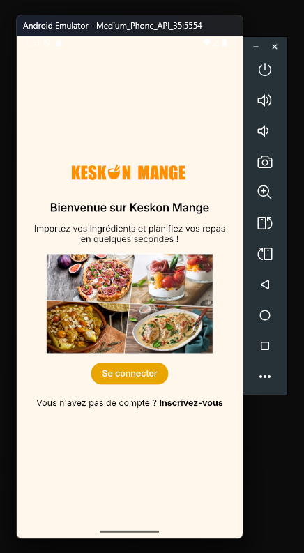

# Setup

## Environment

Copy the `.env.example` file to `.env` and change the environment variables for your environment.

## Local browser development

`npm run dev`

# Tauri (client native application builds)

## Why?

Tauri allows building native applications (to Android, iOS, Windows, Mac, Linux...) using our already existing source code. 

## Setup

`npm install` to install the Tauri package.
Follow [this](https://v2.tauri.app/start/prerequisites/#windows) (Rust, Microsoft C++ Build Tools and WebView2 sections).

## Android setup

Install Android dev tools using [the guide](https://v2.tauri.app/start/prerequisites/#android) or just try to run the build command and follow the prompts / errors.  
Follow "[Creating a keystore and upload key](https://v2.tauri.app/distribute/sign/android/#creating-a-keystore-and-upload-key)" and "[Configure the signing key](https://v2.tauri.app/distribute/sign/android/#configure-the-signing-key)" to setup Android code signing.

You should have a `/src-tauri/gen/android/keystore.properties` file that looks like this:
```
password=your-keystore-password-here
keyAlias=upload
storeFile=C:\\Users\\USER\\upload-keystore.jks
```

## Android dev using an Android Virtual (or physical) Device

Make sure the vite server is configured to listen everywhere:

```javascript
// file: ./vite.config.js
export default defineConfig({
  server: {
    host: '0.0.0.0',
    hmr: {
      // Input your PC local IP address into this field
      host: "192.168.1.10",
      protocol: "ws",
    },
  },
  // The rest of the config
})
```

If you get websocket errors, hot reloading will not work and you have to close and reopen the app for the changes to be visible. Check if the IP address in the hmr section is correct and check your network and firewall settings.

Then, run `npx tauri android dev` and follow the instructions.

If it gets stuck on waiting for dev server to start, try restarting the command.  
You should then get something like this:



You can also use a physical Android device as your development server.  
Just connect that device using ADB and then start the development server.  

In all cases, make sure to modify the backend server URL accordingly.

## Build for Android

`npx tauri android build`  
  
The signed APK file should be under `src-tauri/gen/android/app/build/outputs/apk/universal/release/` if it built correctly.

## Build for other platforms

Building for other platforms is not yet documented / tested.

# React + Vite

This template provides a minimal setup to get React working in Vite with HMR and some ESLint rules.

Currently, two official plugins are available:

- [@vitejs/plugin-react](https://github.com/vitejs/vite-plugin-react/blob/main/packages/plugin-react) uses [Babel](https://babeljs.io/) (or [oxc](https://oxc.rs) when used in [rolldown-vite](https://vite.dev/guide/rolldown)) for Fast Refresh
- [@vitejs/plugin-react-swc](https://github.com/vitejs/vite-plugin-react/blob/main/packages/plugin-react-swc) uses [SWC](https://swc.rs/) for Fast Refresh

## React Compiler

The React Compiler is not enabled on this template because of its impact on dev & build performances. To add it, see [this documentation](https://react.dev/learn/react-compiler/installation).

## Expanding the ESLint configuration

If you are developing a production application, we recommend using TypeScript with type-aware lint rules enabled. Check out the [TS template](https://github.com/vitejs/vite/tree/main/packages/create-vite/template-react-ts) for information on how to integrate TypeScript and [`typescript-eslint`](https://typescript-eslint.io) in your project.